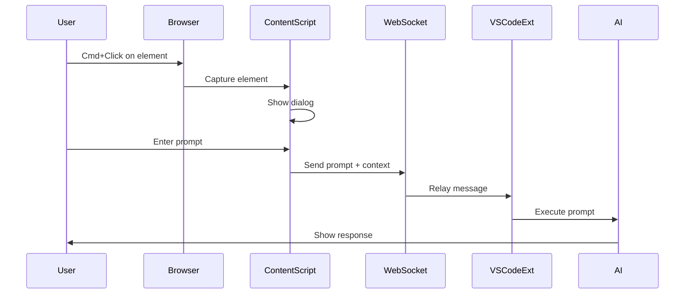

# React Grab VSCode Extension - Developer Guide

## 🏗️ Architecture Overview

This project implements Clean Architecture principles to ensure maintainability, testability, and scalability.

### Core Principles

1. **Dependency Inversion**: High-level modules don't depend on low-level modules
2. **Single Responsibility**: Each class has one reason to change
3. **Open/Closed**: Open for extension, closed for modification
4. **Interface Segregation**: Clients shouldn't depend on interfaces they don't use
5. **Liskov Substitution**: Subtypes must be substitutable for base types

## 📁 Detailed Project Structure

```
react-grab-vscode/
│
├── src/                           # VSCode Extension Source
│   ├── domain/                    # Core Business Logic (No external dependencies)
│   │   ├── entities/             # Business entities
│   │   ├── repositories/         # Repository interfaces
│   │   └── services/             # Domain services
│   │
│   ├── application/              # Use Cases / Application Services
│   │   ├── usecases/            # Business use cases
│   │   ├── dto/                 # Data Transfer Objects
│   │   └── ports/               # Input/Output ports
│   │
│   ├── infrastructure/           # External Interfaces
│   │   ├── vscode/              # VSCode API integration
│   │   ├── copilot/             # AI assistants integration
│   │   ├── websocket/           # WebSocket server
│   │   └── repositories/        # Repository implementations
│   │
│   ├── shared/                   # Shared utilities
│   │   ├── constants/           # Constants and enums
│   │   ├── types/               # TypeScript type definitions
│   │   └── utils/               # Utility functions
│   │
│   └── extension.ts              # Main entry point
│
├── browser-extension/            # Chrome Extension
│   ├── manifest.json            # Extension manifest
│   ├── content-script.js        # Content script for page interaction
│   ├── inject.js                # Injected script for React access
│   ├── background.js            # Service worker
│   ├── popup.html/js            # Extension popup
│   └── styles.css               # UI styles
│
├── test/                         # Test files
│   ├── unit/                    # Unit tests
│   ├── integration/             # Integration tests
│   └── e2e/                     # End-to-end tests
│
└── docs/                         # Documentation
    ├── architecture/            # Architecture diagrams
    ├── api/                     # API documentation
    └── guides/                  # User guides
```

## 🔄 Data Flow

### Component Selection to AI Response



## 🛠️ Key Components

### VSCode Extension Components

#### 1. **WebSocketServer** (`websocket-server.ts`)
- Manages WebSocket connections
- Handles message routing
- Maintains client connections
- Implements reconnection logic

#### 2. **CopilotIntegration** (`copilot-integration.ts`)
- Interfaces with GitHub Copilot Chat
- Interfaces with Claude Code
- Manages prompt execution
- Handles AI selection logic

#### 3. **StatusBarManager** (`status-bar.ts`)
- Visual status indicators
- Connection state display
- Quick action buttons

#### 4. **Logger** (`utils/logger.ts`)
- Centralized logging
- Debug output channel
- Error tracking

### Browser Extension Components

#### 1. **Content Script** (`content-script.js`)
- React element selection
- Dialog management
- WebSocket client
- Message handling

#### 2. **Inject Script** (`inject.js`)
- React DevTools access
- Component information extraction
- Props and state reading

#### 3. **Background Service Worker** (`background.js`)
- Extension state management
- Badge updates
- Message routing

## 🔌 API Reference

### WebSocket Messages

#### Browser → VSCode

```typescript
interface MessageFromBrowser {
  type: 'prompt' | 'ping' | 'element-context';
  prompt?: string;
  target?: 'copilot' | 'claude';
  elementInfo?: {
    tagName: string;
    className: string;
    id: string;
    props?: Record<string, unknown>;
    componentName?: string;
    path?: string;
  };
  timestamp: number;
}
```

#### VSCode → Browser

```typescript
interface MessageToBrowser {
  type: 'success' | 'error' | 'pong' | 'status';
  message?: string;
  timestamp: number;
}
```

### VSCode Commands

| Command | Description |
|---------|-------------|
| `react-grab-copilot.startServer` | Start WebSocket server |
| `react-grab-copilot.stopServer` | Stop WebSocket server |
| `react-grab-copilot.showStatus` | Show connection status |

## 🧪 Testing Strategy

### Unit Tests
- Test individual components in isolation
- Mock external dependencies
- Focus on business logic

### Integration Tests
- Test component interactions
- Verify WebSocket communication
- Test AI integration

### E2E Tests
- Complete user workflows
- Browser to VSCode flow
- AI response verification

## 🔐 Security Considerations

1. **WebSocket Security**
   - Localhost only (127.0.0.1)
   - Port validation
   - Message sanitization

2. **Content Security**
   - Input validation
   - XSS prevention
   - Safe DOM manipulation

3. **Extension Permissions**
   - Minimal required permissions
   - No remote code execution
   - Sandboxed execution

## 📊 Performance Optimization

1. **Lazy Loading**
   - Load AI integrations on demand
   - Defer non-critical resources

2. **Connection Management**
   - Connection pooling
   - Automatic reconnection
   - Heartbeat mechanism

3. **Message Optimization**
   - Compress large payloads
   - Batch similar requests
   - Implement request throttling

## 🚀 Deployment

### Building for Production

```bash
# Clean build
pnpm run clean

# Production build
pnpm run build:prod

# Package extension
pnpm run package

# Generate source maps (optional)
pnpm run build:sourcemaps
```

### Publishing

1. **VSCode Marketplace**
   ```bash
   pnpm run publish
   ```

2. **Chrome Web Store**
   - Package browser-extension folder
   - Upload to Chrome Developer Dashboard

## 🔄 Version Management

Follow Semantic Versioning (SemVer):
- **MAJOR**: Breaking changes
- **MINOR**: New features (backward compatible)
- **PATCH**: Bug fixes

## 📝 Code Style Guide

### TypeScript
- Use strict mode
- Prefer interfaces over types
- Use async/await over promises
- Document public APIs with JSDoc

### Naming Conventions
- **Classes**: PascalCase
- **Interfaces**: IPascalCase (prefix with I)
- **Functions**: camelCase
- **Constants**: UPPER_SNAKE_CASE
- **Files**: kebab-case

### Best Practices
1. Keep functions small and focused
2. Use dependency injection
3. Write tests first (TDD)
4. Document complex logic
5. Handle errors gracefully

## 🐛 Debugging

### VSCode Extension
1. Set breakpoints in TypeScript files
2. Press F5 to start debugging
3. Check Output panel for logs
4. Use Debug Console for evaluation

### Chrome Extension
1. Open `chrome://extensions/`
2. Click "background page" link
3. Use Chrome DevTools
4. Check console for errors

### WebSocket Communication
1. Use Chrome DevTools Network tab
2. Filter by WS (WebSocket)
3. Inspect message frames
4. Monitor connection status

## 📚 Resources

### Documentation
- [VSCode Extension API](https://code.visualstudio.com/api)
- [Chrome Extension Docs](https://developer.chrome.com/docs/extensions/)
- [WebSocket API](https://developer.mozilla.org/en-US/docs/Web/API/WebSocket)
- [React DevTools](https://react.dev/learn/react-developer-tools)

### Libraries Used
- **ws**: WebSocket library for Node.js
- **esbuild**: Fast bundler for TypeScript
- **@vscode/vsce**: VSCode extension packaging

## 🤝 Contributing Guidelines

1. **Code Quality**
   - Run linter before commit
   - Write meaningful commit messages
   - Add tests for new features

2. **Pull Request Process**
   - Create feature branch
   - Write descriptive PR description
   - Link related issues
   - Ensure CI passes

3. **Review Checklist**
   - [ ] Code follows style guide
   - [ ] Tests are included
   - [ ] Documentation updated
   - [ ] No console.log statements
   - [ ] Error handling implemented

## 📈 Metrics and Monitoring

### Key Metrics
- Connection success rate
- Message latency
- Error frequency
- User engagement

### Logging Levels
- **ERROR**: Critical failures
- **WARN**: Potential issues
- **INFO**: General information
- **DEBUG**: Detailed debugging

## 🔮 Future Enhancements

1. **Multi-Framework Support**
   - Vue.js integration
   - Angular support
   - Svelte compatibility

2. **Advanced Features**
   - Component history tracking
   - Batch prompt processing
   - Custom AI model support
   - Team collaboration features

3. **Developer Tools**
   - Performance profiling
   - Component dependency graph
   - Code generation templates
   - Custom prompt library

---

This document is maintained by the development team and should be updated with each major change.